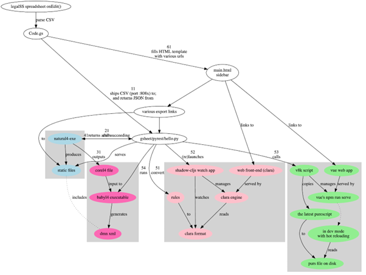

#####################################
Conceptual Explanation of the Backend
#####################################

----------------------
How the Web Tool Works
----------------------

The updates are provided by the L4 backend. A copy of the L4 backend was run on an Amazon Web Services (AWS) instance. The Web Tool is also hosted on the AWS instance.

The first link in the sidebar goes to the Web Tool. It is possible for the legal engineer, taking on the role of the end-user, to experiment with clicking on various inputs to the decision logic, to see what the result becomes. The primary question answered by the tool is “must I notify the PDPC and affected users?”

The gsheet/pyrest/hello.py script, called in this document hello.py, serves the Python REST API. It:
- passes the input CSV to the L4 interpreter natural4-exe (step 11)
which generates static output files;
- triggers the v8k helper script to reconfigure or relaunch the Web Tool (step 53);
- returns URLs for the static output files to the REST client Code.gs (step 61); and
- serves static output files to populate the Google Sheets sidebar (step 11 return)

Future development of this Web Tool would rely on an L4 library which would be provided as an reusable module loaded by individual instances of the L4 spreadsheet. 

Currently the codebase for the Google Sheets App is loaded locally within a Code.gs file, but in future versions of the L4 system, the Code.gs file would import a shared standard library used by multiple L4 spreadsheets.

Instructions for activating the IDE sidebar (a one-time process) are given on the installation page.

-----------------------------------
Explanation of the Google Sheet App
-----------------------------------

The abovementioned sidebar is populated by Code.gs from the template file main.html, by:

- rendering the currently active L4 spreadsheet tab in CSV format;
- uploading the CSV to the Python REST (Representational State Transfer) API (which is served by the hello.py script documented in section :ref:`auto_config`);
- receiving the results in a JSON format; and
- inserting the URLs and images required by the main.html template (step 61).

~~~~~~~~~~~~~~
System diagram
~~~~~~~~~~~~~~

A system diagram depicting the function call graph for the system comprising the gsheet front end, the pyrest middle-tier, and the natural4, v8k, and vue-pure-pdpa backends can be found at https://github.com/smucclaw/gsheet/blob/main/pyrest/architecture.svg 

For convenience a snapshot of that diagram is presented here. The sequence of operations is indicated in the diagram by numbered steps.

The blue (natural4-exe) and green (v8k) boxes are the subject of this section. The other system components corel4 and clara operate in parallel but are not the subject of this section.

----------------------------
How The L4 interpreter Works
----------------------------

The Web Tool is intended to correspond closely to the encoded legislation and regulations, identified hereinafter as the “Natural L4” encoding in the high-level L4 controlled natural language.

To achieve this correspondence, the L4 interpreter parses, interprets, and transpiles the Natural L4 encoding.

Typically, the hello.py script runs natural4-exe. It needs to be present in PATH or its file location can be hardcoded in hello.py. It can also be run by hand.

When it runs:
- the parser component reads the encoded input (from the spreadsheet as a CSV file);
- the interpreter analyses and transforms the parsed input; and
- the transpiler components produce a variety of static output files, including
JSON and Purescript representations of the Boolean structures that form the decision logic of the spreadsheet in question; and
- an intermediate representation in the “Core L4” lower-level language, which is used for type checking and further transpilation to other target languages.

The hello.py script is hardcoded with the paths to the natural4-exe and v8k executables, and with the path to the workdir directory for output. In a local installation, those paths will need to be updated accordingly, at the top of the script.

The static output files are produced by natural4-exe under the workdir directory, under a directory whose filename is unique to the spreadsheet user’s current IDE session, spreadsheet ID field, and sheet (tab) ID field. For example:

.. code-block:: 

    ┌─[20221102-22:23:12]   [mengwong@cclaw:~/pyrest/temp/workdir]
    └─[0] <> tree 28bd5c9a-5e1c-428b-b60a-5aa4d2e03a8d
    28bd5c9a-5e1c-428b-b60a-5aa4d2e03a8d                          ← UUID for the user and session
    └── 1leBCZhgDsn-Abg2H_OINGGv-8Gpf9mzuX1RR56v0Sss              ← spreadsheet ID
        └── 1779650637                                            ← sheet ID
            ├── 20221102T133124.832860Z.csv                       ← timestamp of a specific run
            ├── aasvg                                             ← output dir containing SVGs
            │   ├── 2022-11-02T13:31:27.719Z
            │   │   ├── Notification-anyall.hs
            │   │   ├── Notification-anyall.json
            │   │   ├── Notification-full.svg
            │   │   ├── Notification-qjson.json
            │   │   ├── Notification-qtree.hs
            │   │   ├── Notification-tiny.svg
            │   │   ├── Notify_Individuals-anyall.hs
            │   │   ├── Notify_Individuals-anyall.json
            │   │   ├── Notify_Individuals-full.svg
            │   │   ├── Notify_Individuals-qjson.json
            │   │   ├── Notify_Individuals-qtree.hs
            │   │   ├── Notify_Individuals-tiny.svg
            │   │   ├── index.html
            │   │   ├── it_is-unlikely_that_-anyall.hs
            │   │   ├── it_is-unlikely_that_-anyall.json
            │   │   ├── it_is-unlikely_that_-full.svg
            │   │   ├── it_is-unlikely_that_-qjson.json
            │   │   ├── it_is-unlikely_that_-qtree.hs
            │   │   └── it_is-unlikely_that_-tiny.svg
            │   └── LATEST -> 2022-11-02T13:31:27.719Z
            ├── corel4                            ← output dir containing intermediate representation
            │   ├── 2022-11-02T13:31:27.719Z.l4
            │   └── LATEST.l4 -> 2022-11-02T13:31:27.719Z.l4
            ├── epilog
            │   ├── 20221102T133124.832860Z.epilog
            │   └── LATEST.epilog -> 20221102T133124.832860Z.epilog
            ├── grounds
            │   ├── 2022-11-02T13:31:27.719Z.txt
            │   └── LATEST.txt -> 2022-11-02T13:31:27.719Z.txt
            ├── json
            │   ├── 2022-11-02T13:31:27.719Z.json
            │   └── LATEST.json -> 2022-11-02T13:31:27.719Z.json
            ├── native                            ← output dir containing native Haskell representation
            │   ├── 2022-11-02T13:31:27.719Z.hs
            │   └── LATEST.hs -> 2022-11-02T13:31:27.719Z.hs
            ├── org
            │   ├── 2022-11-02T13:31:27.719Z.org
            │   └── LATEST.org -> 2022-11-02T13:31:27.719Z.org
            ├── petri                             ← output dir containing Petri Net representation
            │   ├── 2022-11-02T13:31:27.719Z-small.png
            │   ├── 2022-11-02T13:31:27.719Z.dot
            │   ├── 2022-11-02T13:31:27.719Z.png
            │   ├── LATEST-small.png -> 2022-11-02T13:31:27.719Z-small.png
            │   ├── LATEST.dot -> 2022-11-02T13:31:27.719Z.dot
            │   └── LATEST.png -> 2022-11-02T13:31:27.719Z.png
            ├── prolog
            │   ├── 2022-11-02T13:31:27.719Z.pl
            │   └── LATEST.pl -> 2022-11-02T13:31:27.719Z.pl
            ├── purs                              ← output dir containing Purescript configuration
            │   ├── 2022-11-02T13:31:27.719Z.purs
            │   └── LATEST.purs -> 2022-11-02T13:31:27.719Z.purs
            ├── ts                                ← output dir containing Typescript representation
            │   ├── 2022-11-02T13:31:27.719Z.ts
            │   └── LATEST.ts -> 2022-11-02T13:31:27.719Z.ts
            └── v8k.out

        15 directories, 45 files

Each of the static files shown above contains a different extract from the original L4 spreadsheet: for example, the native directory contains Haskell code showing intermediate representations of the L4 spreadsheet, while the purs directory contains a Purescript representation of certain decision elements assembled according to the spreadsheet.

As seen above, there is a convention where a LATEST.* file symlinks to a time-stamped file. After multiple runs of the system, where the sidebar is generated and regenerated during edits of the L4 spreadsheet, the LATEST.* files always link to the most recent regeneration. This convention is implemented in the hello.py script. Maintaining multiple copies of the output files is intended to benefit the L4 developer who can efficiently compare old and new outputs.

hello.py performs some post-processing on the static output files produced by natural4-exe. hello.py runs GraphViz to convert dot files to SVG.

The static output files shown above are served upon request over HTTPS by hello.py. 

---------------------
Vue is managed by v8k
---------------------

Multiple “legal engineers” may be working at the same time with different instances of the L4 spreadsheet IDE. As they edit their own instance of the L4 spreadsheet, the Google App Script code refreshes each session’s sidebar with links to the latest versions of the static output files and the Web Tool.

Multiple instances of the Web Tool therefore need to coexist. Each instance is allocated a different port number in the 8001–8010 range, and a different instance of the Vue framework runs on each port. The sidebar links to the appropriate port number, which is served by the appropriate instance. Each instance is launched by npm run serve running out of a separate directory representing a copy of the vue-pure-pdpa codebase. These npm commands run Vue’s vue-cli-service.

It is necessary to run each Vue instance in “development” mode – which explains why we use npm run serve instead of npm run build – so that the updated Purescript file will be hot-reloaded by Vue automatically and quickly made visible to the legal engineer via the sidebar.

After the Web Tool has been approved for production it can be mastered with npm run build and served in a production environment where changes are infrequent. The remainder of this documentation deals with hot-reloads supporting active L4 development.

The vue-pure-pdpa repository contains a Vue application which is enhanced to handle Purescript. As multiple instances of that Vue application are required to support multiple legal engineers working on multiple L4 sessions at the same time, the vue-pure-pdpa repository is duplicated multiple times, across a set of directories:

.. code-block:: 

    ┌─[20221102-22:59:43]   [mengwong@cclaw:~/wow/much]
    └─[1] <> ls -al
    total 144212
    drwxrwxr-x 15 mengwong mengwong      4096 Nov  2 21:34 .
    drwxrwxr-x  5 mengwong mengwong      4096 Jul  4 14:46 ..
    drwxrwxr-x  9 mengwong mengwong      4096 Jul 10 16:29 vue-01
    drwxrwxr-x  9 mengwong mengwong      4096 Jul 10 16:29 vue-02
    drwxrwxr-x  9 mengwong mengwong      4096 Jul 10 16:29 vue-03
    drwxrwxr-x  9 mengwong mengwong      4096 Jul 10 16:29 vue-04
    drwxrwxr-x  9 mengwong mengwong      4096 Jul 10 16:29 vue-05
    drwxrwxr-x  9 mengwong mengwong      4096 Jul 10 16:29 vue-06
    drwxrwxr-x  9 mengwong mengwong      4096 Jul 10 16:29 vue-07
    drwxrwxr-x  9 mengwong mengwong      4096 Jul 10 16:29 vue-08
    drwxrwxr-x  9 mengwong mengwong      4096 Jul 10 16:29 vue-09
    drwxrwxr-x  9 mengwong mengwong      4096 Jul 10 16:29 vue-10
    drwxrwxr-x 12 mengwong mengwong      4096 Jul  5 11:06 vue-big
    drwxrwxr-x  9 mengwong mengwong      4096 Jul 10 16:29 vue-small

This working directory path is recorded in the V8K_WORKDIR environment variable. You may choose an arbitrary directory for your installation.

To reduce disk space, large directories which are common across the vue-xx subdirectories are unified using symlinks to vue-big:

.. code-block:: 

    ┌─[20221102-23:06:59]   [mengwong@cclaw:~/wow/much]
    └─[0] <> ls -l vue-??/node_modules
    lrwxrwxrwx 1 mengwong mengwong 23 Jul  7 16:10 vue-01/node_modules -> ../vue-big/node_modules
    lrwxrwxrwx 1 mengwong mengwong 23 Jul  7 16:10 vue-02/node_modules -> ../vue-big/node_modules
    lrwxrwxrwx 1 mengwong mengwong 23 Jul  7 16:10 vue-03/node_modules -> ../vue-big/node_modules
    lrwxrwxrwx 1 mengwong mengwong 23 Jul  7 16:10 vue-04/node_modules -> ../vue-big/node_modules
    lrwxrwxrwx 1 mengwong mengwong 23 Jul  7 16:10 vue-05/node_modules -> ../vue-big/node_modules
    lrwxrwxrwx 1 mengwong mengwong 23 Jul  7 16:10 vue-06/node_modules -> ../vue-big/node_modules
    lrwxrwxrwx 1 mengwong mengwong 23 Jul  7 16:10 vue-07/node_modules -> ../vue-big/node_modules
    lrwxrwxrwx 1 mengwong mengwong 23 Jul  7 16:10 vue-08/node_modules -> ../vue-big/node_modules
    lrwxrwxrwx 1 mengwong mengwong 23 Jul  7 16:10 vue-09/node_modules -> ../vue-big/node_modules
    lrwxrwxrwx 1 mengwong mengwong 23 Jul  7 16:10 vue-10/node_modules -> ../vue-big/node_modules

The vue-small directory serves as the template source for a particular vue-xx.

The v8k script helps hello.py launch a Web Tool corresponding to the latest input received from Code.gs. Its job is to bring up, reset, and bring down a particular Vue instance.

.. code-block:: 

    ┌─[20221102-23:11:37]   [mengwong@cclaw:~/wow/much]
    └─[0] <> ~/src/smucclaw/vue-pure-pdpa/bin/v8k -h
    usage: v8k [-h] {list,find,up,down,downdir} ...

    Manage a herd of Vue dev servers

    positional arguments:
    {list,find,up,down,downdir}
                            sub-command help
        list                list servers
        find                find server running a certain uuid ssid sid combo
        up                  create, replace, or update a server
        down                bring down a server
        downdir             bring down a server by explicit slot name

    optional arguments:
    -h, --help            show this help message and exit

The status of each running instance is recorded in its vue-xx/v8k.json file:

.. code-block:: 

    ┌─[20221102-23:12:47]   [mengwong@cclaw:~/wow/much/vue-04]
    └─[0] <git:(main 89d183a✱✈) > cat v8k.json | json
    {
    "ssid": "1leBCZhgDsn-Abg2H_OINGGv-8Gpf9mzuX1RR56v0Sss",
    "sheetid": "1779650637",
    "uuid": "28bd5c9a-5e1c-428b-b60a-5aa4d2e03a8d",
    "port": 8004,
    "slot": "04",
    "dir": "/home/mengwong/wow/much/vue-04",
    "base_url": "/28bd5c9a-5e1c-428b-b60a-5aa4d2e03a8d/1leBCZhgDsn-Abg2H_OINGGv-8Gpf9mzuX1RR56v0Sss/1779650637",
    "cli": "npm run serve -- --port=8004 &"
    }

The hello.py script runs v8k:

.. code-block:: 

    ┌─[20221102-23:14:32]   [mengwong@cclaw:~/src/smucclaw/gsheet/pyrest]
    └─[0] <git:(main a7b4ab3) > grep v8k hello.py
        #     call v8k up
        v8kargs = ["/home/mengwong/pyrest/bin/python", "/home/mengwong/src/smucclaw/vue-pure-pdpa/bin/v8k", "up",
        print("hello.py main: calling %s" % (" ".join(v8kargs)), file=sys.stderr)
    # v8k = subprocess.run(v8kargs,
        os.system(" ".join(v8kargs) + "> " + uuidssfolder + "/v8k.out");
        print("hello.py main: v8k up returned", file=sys.stderr)
        with open(uuidssfolder + "/v8k.out", "r") as read_file:
        v8k_out = read_file.readline();
        print("v8k.out: %s" % (v8k_out), file=sys.stderr)
        # v8k_out = v8k.stdout.decode('utf-8')
        if re.match(r':\d+', v8k_out): # we got back the expected :8001/uuid/ssid/sid whatever from the v8k call
        v8k_url = v8k_out.strip()
        print("v8k up succeeded with: " + v8k_url, file=sys.stderr)
        response['v8k_url'] = v8k_url
        v8k_url = ""
        response['v8k_url'] = None
        #      v8k_error = v8k.stderr.decode('utf-8')
        #      print("hello.py main: v8k up stderr: " + v8k_error,                  file=sys.stderr)
        #      print("hello.py main: v8k up stdout: " + v8k.stdout.decode('utf-8'), file=sys.stderr)

The vue-small directory is used as the source for an rsync call that creates the vue-NN “runtime” copies.

.. _6.4_gunicorn:

-------------------------------
hello.py is managed by gunicorn
-------------------------------

The hello.py script is launched within a long-lived screen(1) (or tmux) session running on a Linux server, using gunicorn to support parallelism and preload for faster response time. This response time is visible to the L4 engineer when the sidebar loads static elements, particularly the PNGs of the process and decision visualizations.

We configure the V8K_WORKDIR environment variable for use by v8k:

.. code-block:: 

    ┌─[20221102-23:03:25]   [mengwong@cclaw:~]
    └─[0] <> export V8K_WORKDIR="/home/mengwong/wow/much"

    On the backend server, in one screen, we launch gunicorn to run hello.py:
    ┌─[20221102-23:00:59]   [mengwong@cclaw:~/pyrest]
    └─[0] <> gunicorn --certfile /etc/letsencrypt/live/cclaw.legalese.com/cert.pem \
                    --keyfile /etc/letsencrypt/live/cclaw.legalese.com/privkey.pem \
                    --workers=5 \
                    --bind 0.0.0.0:8080 \
                    --pythonpath /home/mengwong/pyrest/lib/python3.8/site-packages/ \
                    wsgi:app

On another screen, we launch it with a different bind command:

``--bind 0.0.0.0:8081``

Now there are ten hello.py servers running: five on 8080 and five on 8081.

This is useful because if you are actively developing the backend, you can run a “production” version on port 8080 and one or more “development” versions on 8081, 8082, and so on. If needed, you can further refine the distinction between production and development by configuring different hello.py to run different natural4-exe and v8k executables.

As an alternative to the command-line configuration shown above, a gunicorn.conf.py file is available in the gsheet repository. The command line invocation using this approach is:

``gunicorn -c gunicorn.conf.py wsgi:app``

Each server runs an instance of hello.py. That is what wsgi:app does:

.. code-block:: 

    ​┌─[20221102-23:23:45]   [mengwong@cclaw:~/pyrest]
    └─[127] <> cat wsgi.py
    from hello import app

    if __name__ == "__main__":
        app.run()%

~~~~~~~~~~~~~~~~~~~~~~~~~~~~~~~~~~~~~~~~~~~~~~~~
Analysis of an example gunicorn/hello.py logfile
~~~~~~~~~~~~~~~~~~~~~~~~~~~~~~~~~~~~~~~~~~~~~~~~

The following log was captured from a typical invocation of the gunicorn/hello.py script with interspersed remarks.

.. code-block:: 

    [2022-12-02 17:16:24 +0800] [3360812] [INFO] Booting worker with pid: 3360812
    hello.py processCsv() starting at  2022-12-02 17:21:49.002760
    ./temp/workdir/5fc0aa1e-9f2c-403e-96a9-6d0011a01479/1leBCZhgDsn-Abg2H_OINGGv-8Gpf9mzuX1RR56v0Sss/1505307398/
    hello.py main: calling natural4-exe
    hello.py main: natural4-exe --workdir=./temp/workdir --uuiddir=5fc0aa1e-9f2c-403e-96a9-6d0011a01479/1leBCZhgDsn-Abg2H_OINGGv-8Gpf9mzuX1RR56v0Sss/1505307398 ./temp/workdir/5fc0aa1e-9f2c-403e-96a9-6d0011a01479/1leBCZhgDsn-Abg2H_OINGGv-8Gpf9mzuX1RR56v0Sss/1505307398/20221202T092149.234659Z.csv
    hello.py main: back from natural4-exe (took 0:00:11.995794 seconds)
    hello.py main: natural4-exe stdout length = 3797
    hello.py main: natural4-exe stderr length = 0

The natural4-exe invocation may take up to 15 seconds to run. It is possible to reduce the runtime by passing the --tomd flag which would disable natural language generation output to Markdown format. Without NLG the runtime is typically 200ms.

.. code-block:: 

    hello.py main: running: dot -Tpng -Gdpi=150 ./temp/workdir/5fc0aa1e-9f2c-403e-96a9-6d0011a01479/1leBCZhgDsn-Abg2H_OINGGv-8Gpf9mzuX1RR56v0Sss/1505307398/petri/LATEST.dot -o ./temp/workdir/5fc0aa1e-9f2c-403e-96a9-6d0011a01479/1leBCZhgDsn-Abg2H_OINGGv-8Gpf9mzuX1RR56v0Sss/1505307398/petri/2022-12-02T09:21:49.255Z.png &

hello.py calls graphviz to turn the dot files into SVG. These are run as background processes so as not to slow down the primary thread. Note the “&” at the end.

.. code-block:: 

    hello.py main: running: l4 epilog ./temp/workdir/5fc0aa1e-9f2c-403e-96a9-6d0011a01479/1leBCZhgDsn-Abg2H_OINGGv-8Gpf9mzuX1RR56v0Sss/1505307398/corel4/LATEST.l4 > ./temp/workdir/5fc0aa1e-9f2c-403e-96a9-6d0011a01479/1leBCZhgDsn-Abg2H_OINGGv-8Gpf9mzuX1RR56v0Sss/1505307398/epilog/20221202T092149.234659Z.epilog

hello.py calls the corel4 transpiler to produce epilog output. Again, this is run as a background process.

.. code-block:: 

    hello.py main: calling python /home/mengwong/src/smucclaw/vue-pure-pdpa/bin/v8k --workdir=/home/mengwong/wow/much up --uuid=5fc0aa1e-9f2c-403e-96a9-6d0011a01479 --ssid=1leBCZhgDsn-Abg2H_OINGGv-8Gpf9mzuX1RR56v0Sss --sheetid=1505307398 --startport=8081 

hello.py calls the v8k controller to launch the Vue web server or reset it with a new Purescript file.

.. code-block:: 

    ./temp/workdir/5fc0aa1e-9f2c-403e-96a9-6d0011a01479/1leBCZhgDsn-Abg2H_OINGGv-8Gpf9mzuX1RR56v0Sss/1505307398/purs/LATEST.purs
    ** startport = 8081
    ** poolsize = 9
    ** found allegedly existing server(s) on our uuid/ssid/sheetid: 01
    pid 3360758 is listening on port 8082
    pid 3360769 is listening on port 8082
    pid 3360770 is listening on port 8082
    server seems to be still running for port 8082!
    refreshing the purs file
    cp ./temp/workdir/5fc0aa1e-9f2c-403e-96a9-6d0011a01479/1leBCZhgDsn-Abg2H_OINGGv-8Gpf9mzuX1RR56v0Sss/1505307398/purs/LATEST.purs /home/mengwong/wow/much/vue-01/src/RuleLib/PDPADBNO.purs
    hello.py main: v8k up returned
    v8k.out: :8082/5fc0aa1e-9f2c-403e-96a9-6d0011a01479/1leBCZhgDsn-Abg2H_OINGGv-8Gpf9mzuX1RR56v0Sss/1505307398

The v8k controller returns its port and path to hello.py, to be passed back to sidebar.

.. code-block:: 

    v8k up succeeded with: :8082/5fc0aa1e-9f2c-403e-96a9-6d0011a01479/1leBCZhgDsn-Abg2H_OINGGv-8Gpf9mzuX1RR56v0Sss/1505307398
    hello.py processCsv returning at 2022-12-02 17:22:01.170612 (total 12.16785216331482 seconds)

Hello.py terminates after 12.168 seconds.

.. code-block:: 

    40% building 0/1 modules 1 active ...ode_modules/purs-loader/lib/index.js??ref--14-0!/home/mengwong/wow/much/vue-01/src/RuleLib/PDPADBNO.pursgetWorkdirFile: returning 

The vue app’s npm run serve produces a dribble of reset logging – above, the “40%” is indicative of the server reset.

During population of the sidebar, the spreadsheet requests a variety of PNGs and SVGs from the backend; these static file requests are handled by hello.py as well.

.. code-block:: 

    ./temp/workdir/5fc0aa1e-9f2c-403e-96a9-6d0011a01479/1leBCZhgDsn-Abg2H_OINGGv-8Gpf9mzuX1RR56v0Sss/1505307398/petri/LATEST-small.png
    showAasvgImage: handling /aasvg/ url
    showAasvgImage: sending path ./temp/workdir/5fc0aa1e-9f2c-403e-96a9-6d0011a01479/1leBCZhgDsn-Abg2H_OINGGv-8Gpf9mzuX1RR56v0Sss/1505307398/aasvg/LATEST/Qualifies-tiny.svg

