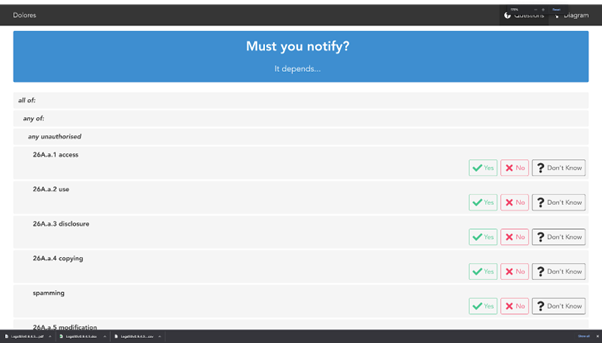

.. _webtool:

====================================================
Installation and setup instructions of the Web Tool
====================================================

Installation instructions for the Web Tool were taken and edited from
https://github.com/smucclaw/vue-pure-pdpa

The reader will be able to install the Web Tool even if they are unfamiliar with some of Vue, Purescript, or Haskell.

- Vue is a framework similar to React and Angular, providing infrastructure for component-oriented single-page web application development. We chose it for its excellent support for hot-reloading and re-rendering.
  
- Purescript is a functional language that compiles to Javascript, used for the configuration and interactive recomputation of the interview results. We chose it because it lies at the intersection of Haskell-style functional programming and `compatibility with Javascript and Vue <https://sliptype.com/functional-front-end/>`_ [#f1]_ for web development.
  
- Haskell is a functional language used to implement the L4 parser, interpreter, transpilers, and intermediate representation components. We chose it because it is generally recognized as a good choice for language engineering and writing compiler-related tools [#f2]_.

Future development of this Web Tool will involve a design team familiar with the above technologies.

------------
Requirements
------------

`NodeJS <https://nodejs.dev/en/learn/how-to-install-nodejs/>`_ (versions 16 and above)

---------------
Setup and Usage
---------------

Clone the `SMU CCLAW vue-pure-pdpa github page <https://github.com/smucclaw/vue-pure-pdpa>`_.

~~~~~~~~~~~~~~~~~~~~~~~~~~~~~~~~~~~~~~~~~~~
Configuring Environment Variables with .env
~~~~~~~~~~~~~~~~~~~~~~~~~~~~~~~~~~~~~~~~~~~

Before proceeding with the steps below, copy the ``.env.example`` to ``.env`` in your cloned vue-pure-pdpa repository. You can do this with the following command:

.. code-block::

    mv .env.example .env

Inside the newly created ``.env`` file, configure the following settings according to your application:

.. code-block:: 

    BASE_URL=/
    VUE_APP_BROWSER_NAME=CCLAW
    VUE_APP_NAME="PDPA DBNO PoC - Draft"

~~~~~~~~~~~~~~
Installing NVM
~~~~~~~~~~~~~~

NVM is a version manager for node. Follow the instructions on the `nvm github <https://github.com/nvm-sh/nvm>`_.

~~~~~~~~~~~~~~~~~~~
Installing Packages
~~~~~~~~~~~~~~~~~~~

Run the following set of install scripts:

.. code-block::

    nvm use
    nvm install
    nvm exec
    npm install -g node-gyp@latest
    npm run deps

~~~~~~~~~~~~~~~~~~~~~~
Running in Development
~~~~~~~~~~~~~~~~~~~~~~

Start the application in development mode by running:

``$ npm run serve``

The application can be accessed at ``localhost:8080``.

~~~~~~~~~~~~~~~~~~~~~~~
Building for Production
~~~~~~~~~~~~~~~~~~~~~~~

To build the application for production, run:

``$ npm run build``

This command should produce a ``dist/`` directory. Deploy the contents in the ``dist/`` directory to your application of choice (e.g. Github pages).

An example can be found at https://smucclaw.github.io/vue-pure-pdpa/ or https://smucclaw.github.io/mengwong/pdpa/.

~~~~~~~~~~~~
Using Docker
~~~~~~~~~~~~

Alternatively, you may run this application on a Docker container by running:

``$ docker-compose up --build``

~~~~~~~~~
Using v8k
~~~~~~~~~

v8k is a little server-management script that allocates new development servers to ports in the 8000 range.

Once you're able to run ``npm run serve`` you can think about spawning new servers in response to updates from the Python/Flask/natural4-exe end of things.

Spawning new servers allows you to edit work in one server without affecting another server, such as when you have multiple sheets of different rules.

^^^^^^^^^^^^^^
Setting up v8K
^^^^^^^^^^^^^^

You only have to do this once:

.. code-block:: 

    mkdir ~/v8kworkdir
    cd ~/v8kworkdir
    export V8K_WORKDIR=~/v8kworkdir
    rsync -va ~/src/smucclaw/vue-pure-pdpa/ vue-big/
    rsync -va --exclude={.spago,.git,node_modules} vue-big/ vue-small/
    cd vue-small
    ln -s ../vue-big/.git .
    ln -s ../vue-big/node_modules .
    ln -s ../vue-big/.spago .

Note that for the 3rd command, ``rsync -va ~/src/smucclaw/vue-pure-pdpa/ vue-big/``, you should replace ``~/src/smucclaw/vue-pure-pdpa/`` with the folder where you cloned the vue-pure-pdpa github page.

^^^^^^^^^^^^^^^^^^^^^
Spawning a new server
^^^^^^^^^^^^^^^^^^^^^

Note that you do not have to run the following commands; this is just an explanation of how the Pythong Flask subsystem spawns a server.

Every time the Python Flask subsystem runs natural4-exe to refresh the workdir output, it will want to tell Vue that there is a new .purs file that contains a Rule Library.

It should run:

``~/src/smucclaw/vue-pure-pdpa/bin/v8k up --uuid=000 --ssid=111 --sheetid=222 ~/src/smucclaw/dsl/lib/haskell/natural4/workdir/000/111/222/purs/LATEST.purs``

The STDOUT of this command will be a port number and path. Append that to the server public ip or domain name to get something like

http://18.139.62.80:8001/000/111/222/

And a few seconds later that link should serve an instance of your personal Vue app configured with the ``LATEST.purs`` that you gave it. [#f3]_

The above ``up`` call is idempotent: the Flask system can just re-run it when the ``workdir`` changes and serve the constructed URL back to the sidebar. Most of the time the URL will not change but sometimes it will, so do read it each time.

^^^^^^^^^^^^^^^^^^^^^^
Bringing Down A Server
^^^^^^^^^^^^^^^^^^^^^^

Usually you can just leave the servers running. The v8k script has the notion of a pool, whose default size is 10; after 10 slots are allocated, new up commands will overwrite the oldest server.

If you have the notion of "ending a session" in the Google Sheets "IDE" frontend, the Python Flask subsystem is invited to call

``~/src/smucclaw/vue-pure-pdpa/bin/v8k down --uuid=000 --ssid=111 --sheetid=222``

This will deallocate the running instance and make the slot available.

^^^^^^^^^^^^^^^^^^^^^^^^^^^^^^^^^^^^^^^^^^^^^^^^
Bringing Down A Server through a forced shutdown
^^^^^^^^^^^^^^^^^^^^^^^^^^^^^^^^^^^^^^^^^^^^^^^^

There are 10 slots per v8K run.

If you are certain you want to bring down one of the slots, say, slot 03, run:

``~/src/smucclaw/vue-pure-pdpa/bin/v8k downdir 03``

^^^^^^^^^^^^^^^^^^^^^^^^^^^^^^^^^^^^^^^^
Checking to see what's running using v8k
^^^^^^^^^^^^^^^^^^^^^^^^^^^^^^^^^^^^^^^^

This command should, in theory, walk the V8K_WORKDIR to see what's going on.

``~/src/smucclaw/vue-pure-pdpa/bin/v8k list``

^^^^^^^^^^^^^^^^^^^^^^^^^^^^^^
Checking to see what's running
^^^^^^^^^^^^^^^^^^^^^^^^^^^^^^

If you do not trust v8K, probe the OS:

``ps wwaux | grep port=80``

to see what's on port 80something.

======================
Accessing the Web Tool
======================

The web-based self-assessment tool for data breach notifications (hereinafter called the “Web Tool”) can be accessed via a link in the sidebar which appears in the L4 spreadsheet.

When the spreadsheet is being actively edited by a “legal engineer”, the sidebar and the Web Tool automatically update to reflect changes. To force a refresh of the sidebar without editing the sheet, click the checkbox in the top row (shown highlighted in the screenshot below).

To access the Web Tool, click on the first link in the sidebar in the spreadsheet UI.

A snapshot of the Web Tool is attached in the form of a tar.gz file, containing a vue directory which contains the source code of the tool. From inside that directory, the Web Tool can be built and rebuilt using the commands ``npm run serve`` and ``npm run build``. For more information on running Vue, see the Vue Guides.

The Web Tool can run in both https and http-only modes. The configuration options for https operation are given in section :ref:`https-needed`.

There is a “diagram” link in the Web Tool which visualizes the decision tree. This component is outside the scope of the use case and should be ignored. The roadmap for this Web Tool revises its diagram component to match the decision diagrams shown in the spreadsheet sidebar.

.. rubric:: Footnotes

.. [#f1] via purs-loader: https://github.com/ethul/purs-loader
.. [#f2] https://www.reddit.com/r/haskell/comments/tyl1zr/why_is_haskell_considered_good_for_writing_a/ 
.. [#f3] The working name for this expert-system part of the web app is called Orwell, because it is good at evaluating And/Or trees in the context of a mechanized public service interface with the public that computes truth values.
