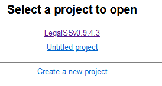

=========================================
Interacting with L4 through a spreadsheet
=========================================

Your primary interface with L4 will be through a google sheet called 'LegalSS'.

The LegalSS spreadsheet has the current version number at the end of the name. For example, this documentation was written with a LegalSS spreadsheet version number '0.9.4.3'. This is reflected in the LegalSS spreadsheet name as 'LegalSSv0.9.4.3'.

--------------------------------
Making a copy of the spreadsheet
--------------------------------

1. Make a copy of the LegalSS spreadsheet by clicking on 'File' at the toolbar, then choose the 4th option 'Make A Copy'.

2. You should get a pop-up like in this image:

3. Choose where you want to copy the spreadsheet. In this example, we copy to "My Drive"

4. Rename the result: this will be your copy of the LegalSS spreadsheet tutorial.

.. _Activate_sheets_ide:

----------------------------
Activating the L4 Sheets IDE
----------------------------

A one-time procedure is needed to activate the L4 interface within your copy of the LegalSS spreadsheet.

1. Click on Extensions/Apps Script. 
   
.. image:: ../L4manual-images/apps-script-screenshot.png

2. A new tab will open on your browser and you will be asked to select a project to open. Choose the first project "LegalSS..." with the version number, in this case, "LegalSSv0.9.4.3". Do not click on "Untitled Project".

You should be directed to a page similar to the below screenshot.

.. image:: ../L4manual-images/apps-script-page-screenshot.png

3. When the Apps Script page loads, go back to your copy of LegalSS spreadsheet in your browser and select the tab "Quickstart", which is the first tab of the LegalSS spreadsheet.

.. image:: ../L4manual-images/pdpa-dbno-selection-screenshot.png
    
4. Back in the App Script page, click "Run" to execute the function. You will have to grant permission to the App Script to make changes to Google Sheets.

.. image:: ../L4manual-images/select-run-on-sheet-ide-screenshot.png

An Execution Log should appear below the App Script. Wait until you read "Execution Completed", highlighted in yellow, before you move on to the next step.

.. image:: ../L4manual-images/execution-completed-screenshot.png

5. Return to the LegalSS Spreadsheet. You should see a sidebar appear on the right side of the page. 

If you do not see a sidebar, contact the L4 developers for help.

-----------------------------
Manually Updating the Sidebar
-----------------------------

The sidebar has an auto-update function when words are typed in. However, if the auto-update function does not work, you can re-run the app script detailed in step 4 of :ref:`Activate_sheets_ide`.

----------
Next Steps
----------

Once you have finished installation, consider exploring:

- :ref:`The tour of L4 <tour_of_L4>`, which tells you what L4 is at a glance.

- :ref:`The exercises <Learning L4_Exercises>`, which teaches you how to formalise simple rules in L4.