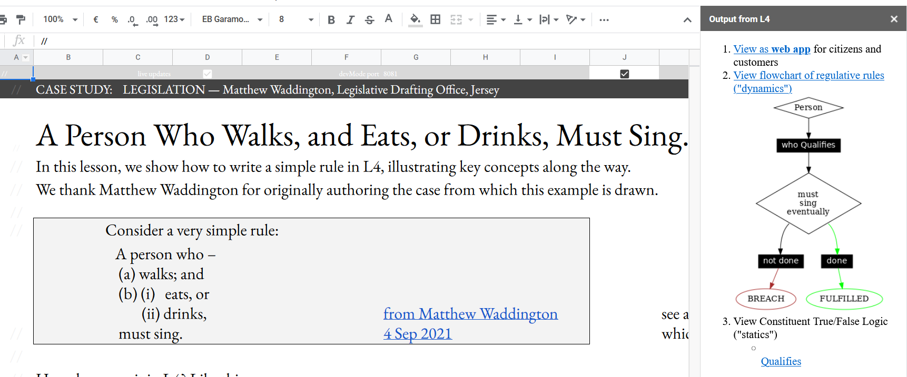
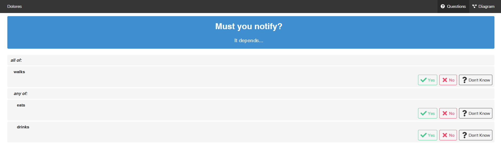

.. _tour_of_L4:

##############################
Tour of L4
##############################

***********************
What is L4
***********************

L4 offers a low-code way for non-lawyers to explore existing contracts and legislation, and to generate new contracts and regulations. 

====================
L4 is 'law-specific'
====================

L4 is a domain-specific language specifically designed for the law domain, which makes it 'law-specific'.

====================
L4 outputs a diagram
====================

L4 generates convenient visualizations of the logic and the moving parts of your "legal program"

Specifying legislation in L4 gives you a diagram that allows you to get from a legal position A to legal position B at a glance.

============================================================
L4 checks for loopholes and conflicts
============================================================

L4 sanity-checks your programs to detect internal conflicts and loopholes.

========================================
L4 generates a web tool
========================================

L4 automatically generates a web app that helps end users explore the logic of your "legal program".

============================================================
L4's diagram ouput can be converted to multiple formats
============================================================

The diagrammatic output can be converted to a language you need such as Haskell.

========================================
L4 uses spreadsheets for interaction
========================================

L4 uses a spreadsheet interface to allow lawyers to interact with L4 in an environment that they are comfortable in.

========================================
L4 contains a package library
========================================

The L4 package library contains encodings of insurance policies based on those offered by major insurers. 

In addition to contracts, L4's package library also contains encodings of legislation and regulation in the areas of data privacy and building permission.

The available contracts allows you to generate a document you can sign after running it past a lawyer for review.

The L4 package library will soon contain loan agreements, leasing agreements, and investment agreements. 