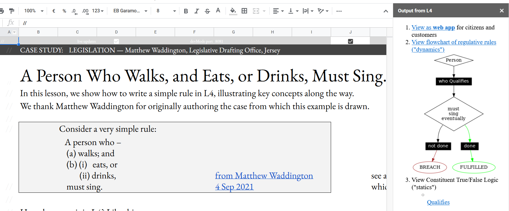

.. _tour_of_L4:

###########
Why use L4?
###########

**L4 gives non-lawyers a "low-code" way to explore and produce legal "programs".**

----------------------------------------------------------
L4 helps people **understand** complicated legal documents
----------------------------------------------------------

To understand complicated **logic**  like *and, or, unless*: view the *decision diagram* to get the big picture. (See: :ref:`the 'must sing' example <eg_mustsing>`; or :ref:`the Rodent Insurance example <eg_rodent>`)

To understand complicated **processes** like *deadlines and obligations*: view the *state diagram* to see how events change state over time, leading to new obligations for parties. Identify a goal and see what you need to do to achieve it.

To understand complicated **rule interactions** like *notwithstanding, subject to*: view the *meta-rule analysis* to see how rules interact.

-----------------------------------------------
L4 helps end-users **explore** legal situations
-----------------------------------------------

You can ask *"why?"*: Interactively drill down into every decision. 

You can ask *"how?"*: if you state a goal you want to achieve, L4 will outline a course of action.

--------------------------------------------------
L4 helps legal engineers **draft** with confidence
--------------------------------------------------

L4 is a DSL: a **domain-specific language** designed for the legal domain. Some call it "low-code".

The "formal methods" components of the L4 toolchain automatically analyzes your program for loopholes and inconsistencies.

L4's unit test framework lets you set up test scenarios and monitor them as your contracts evolve.

L4's library of components makes it easier to **draft legal templates and automatically produce legal documents** for signature.

------------------------------------------------------
L4 helps enterprises **manage** their contract library
------------------------------------------------------
Enterprise users can integrate L4 into their existing contract
lifecycle management systems to support more sophisticated queries
than their CLM databases allow.

----------------------------------------------------
L4 helps governments **streamline** service delivery
----------------------------------------------------

Government agencies innovating with "Rules as Code" can use L4 basis
for automating the generation of citizen-facing web applications and
chatbots.

--------------------
L4 outputs a diagram
--------------------

L4 generates convenient visualizations of the logic and the moving parts of your "legal program"

Specifying legislation in L4 gives you a diagram that allows you to get from a legal position A to legal position B at a glance.

-------------------------------------
L4 checks for loopholes and conflicts
-------------------------------------

L4 sanity-checks your programs to detect internal conflicts and loopholes.

-----------------------
L4 generates a web tool
-----------------------

L4 automatically generates a web app that helps end users explore the logic of your "legal program".
.. image:: ../L4manual-images/web-tool-screenshot.png

-------------------------------------------------------
L4's diagram ouput can be converted to multiple formats
-------------------------------------------------------
The diagrammatic output can be converted to a language you need such as Haskell.

------------------------------------
L4 uses spreadsheets for interaction
------------------------------------

L4 uses a spreadsheet interface to allow lawyers to interact with L4 in an environment that they are comfortable in.

-----------------------------
L4 contains a package library
-----------------------------

The L4 package library contains encodings of insurance policies based on those offered by major insurers. 

In addition to contracts, L4's package library also contains encodings of legislation and regulation in the areas of data privacy and building permission.

The available contracts allows you to generate a document you can sign after running it past a lawyer for review.

The L4 package library will soon contain loan agreements, leasing agreements, and investment agreements.